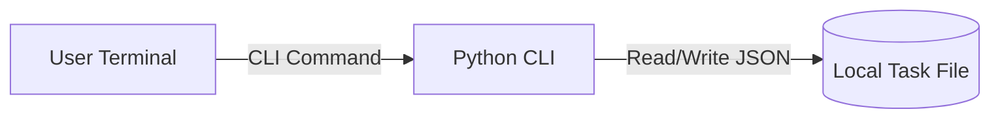

# Threat Model

**Project:** Todo CLI
**Last reviewed:** 2026-04-07
**Reviewed by:** Pierrot, Archie

## System Overview

A single-user Python CLI manages personal todo items stored in a local JSON file. The application performs local file I/O only and has no network-facing API in v1.

## Data Flow Diagram

## Trust Boundaries

| Boundary | Description | Controls |
|----------|-------------|----------|
| User shell -> CLI process | Command input enters process | Arg parsing, input validation |
| CLI process -> filesystem | Persistent writes to local file | Atomic file writes, file permissions |

## Assets

| Asset | Classification | Storage | Impact if compromised |
|-------|---------------|---------|----------------------|
| Task titles/descriptions | Private | Local JSON file | Personal information disclosure |
| Due dates and estimates | Private | Local JSON file | Planning disruption, privacy exposure |
| Task integrity | Integrity-critical | Local JSON file | Lost or incorrect task state |

## STRIDE Analysis

### Spoofing (Identity)

| Component | Threat | Likelihood | Impact | Mitigation | Status |
|-----------|--------|------------|--------|------------|--------|
| CLI invocation | Another local user runs CLI on shared machine | Low | Medium | OS account separation; optional file permissions docs | Open |

### Tampering (Data Integrity)

| Component | Threat | Likelihood | Impact | Mitigation | Status |
|-----------|--------|------------|--------|------------|--------|
| Local task file | Manual or accidental file edits corrupt JSON | Medium | High | Atomic writes, parse validation, backup-on-write option | Mitigated |

### Repudiation (Accountability)

| Component | Threat | Likelihood | Impact | Mitigation | Status |
|-----------|--------|------------|--------|------------|--------|
| Task updates | No trace of who changed what | Low | Low | Single-user scope accepted; optional local history later | Accepted |

### Information Disclosure (Confidentiality)

| Component | Threat | Likelihood | Impact | Mitigation | Status |
|-----------|--------|------------|--------|------------|--------|
| Local task file | Sensitive task text readable by other local accounts | Medium | Medium | Recommend restricted file permissions in docs | Open |

### Denial of Service (Availability)

| Component | Threat | Likelihood | Impact | Mitigation | Status |
|-----------|--------|------------|--------|------------|--------|
| Task file handling | Corrupt file prevents app startup | Medium | Medium | Graceful error, recovery path, optional backup restore | Mitigated |

### Elevation of Privilege (Authorization)

| Component | Threat | Likelihood | Impact | Mitigation | Status |
|-----------|--------|------------|--------|------------|--------|
| Local execution | CLI used with elevated OS privileges unexpectedly | Low | Low | No privileged operations; principle of least privilege in docs | Accepted |

## Attack Surface Inventory

| Surface | Protocol | Auth required? | Exposed to | Notes |
|---------|----------|---------------|------------|-------|
| CLI args/stdin | Local process call | OS user context | Local machine users | Validate/normalize all user input |
| Local task file | Filesystem I/O | OS file permissions | Local machine users | Use atomic writes and validation |

## Open Risks

| Risk | Severity | Rationale for acceptance | Review date |
|------|----------|------------------------|-------------|
| Shared-machine local disclosure | Medium | Out of v1 scope; document safe permissions | 2026-05-01 |
| No cryptographic tamper evidence | Low | Single-user local utility, low adversarial model | 2026-05-01 |
